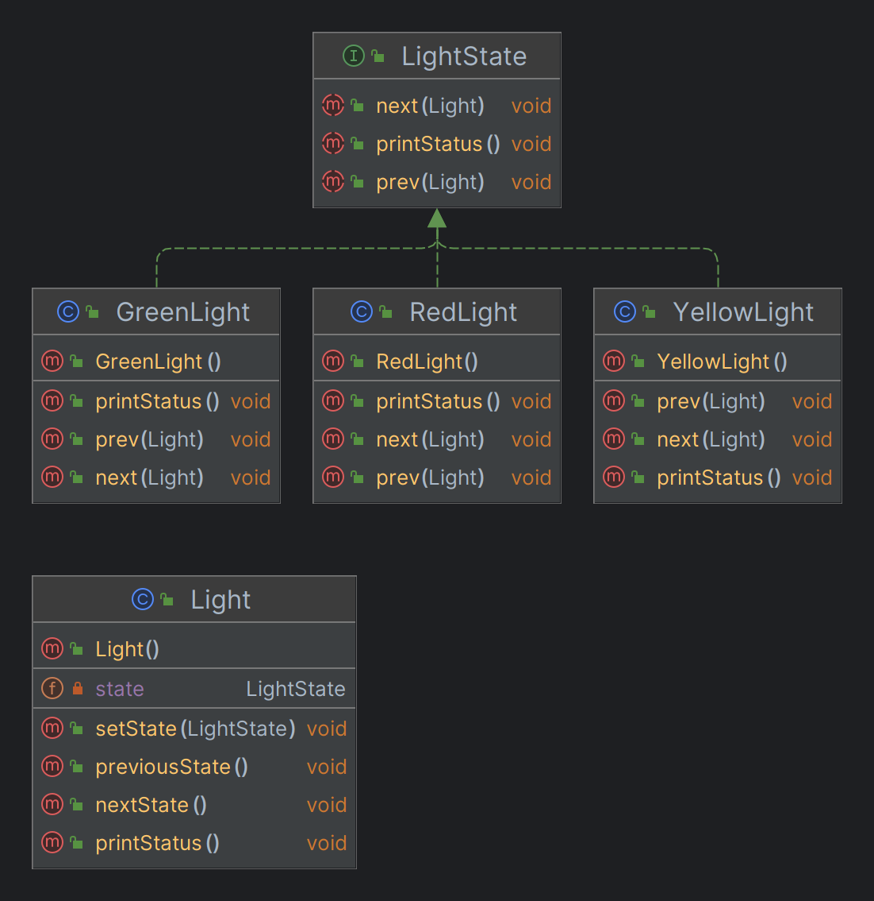

# state design-pattern

State design pattern allows object to change behavior when internal state changes. 
It allows for a cleaner code without repetitive if-else statements.

this approach is a direct application to FSM where you declare states and link them to previous and next state. 

## Example
In the code example you can see a basic implementation of the streetlight FSM: red --> green --> yellow --> red.

