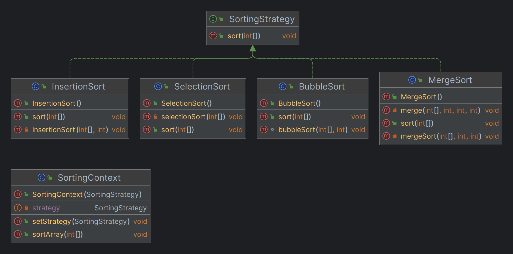

# Strategy

The Strategy design pattern is a behavioral design pattern that allows an object to vary its behavior at runtime by encapsulating different algorithms and making them interchangeable.

The main idea behind the Strategy pattern is to define a family of algorithms, encapsulate each one as an object, and make them interchangeable. This pattern is particularly useful when we have a set of related algorithms that can be used in a given context, but the choice of the specific algorithm to use is made at runtime.

## How does the strategy design pattern works?

1. Context: This is the object that will use the strategy objects. It has a reference to a strategy object and can switch between different strategies at runtime.
2. Strategy Interface: This is the interface that defines the methods that all strategy objects must implement.
3. Concrete Strategies: These are the implementations of the strategy interface. Each concrete strategy encapsulates a specific algorithm.

## Benefit of strategy design pattern

* The ability to switch between different algorithms at runtime without changing the code of the context.
* Improved encapsulation, as each algorithm is encapsulated within a separate strategy object.
* Easier maintenance and extensibility, as new algorithms can be added by implementing a new strategy object without affecting the existing code.

## Example

