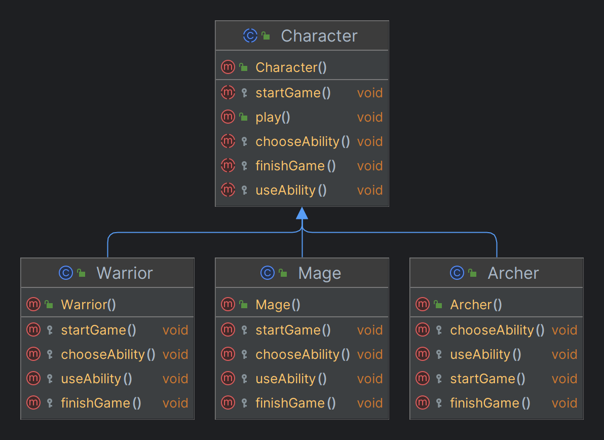

# Template Method

The Template Design Pattern is a behavioral design pattern that defines the skeleton of an algorithm in a superclass but lets subclasses override specific steps of the algorithm without changing its structure. This pattern is useful when you have multiple implementations of a common algorithm, but the overall structure of the algorithm remains the same.

The Template Design Pattern can be useful in scenarios where you need to implement a similar algorithm in multiple classes, but each class may have different requirements for certain steps of the algorithm. By using the Template Design Pattern, you can avoid code duplication and create a more maintainable and extensible codebase.

## How does the template design pattern works?
1. Abstract Base Class: Defines the basic structure of the algorithm with abstract methods that must be implemented by the concrete classes.
2. Concrete Classes: Implements the abstract methods defined in the abstract base class to provide specific functionality for the algorithm.
3. Template Method: The template method is defined in the abstract base class and calls the abstract methods to execute the algorithm.
4. Create an instance of the concrete class and invoke the template method.

## Example
