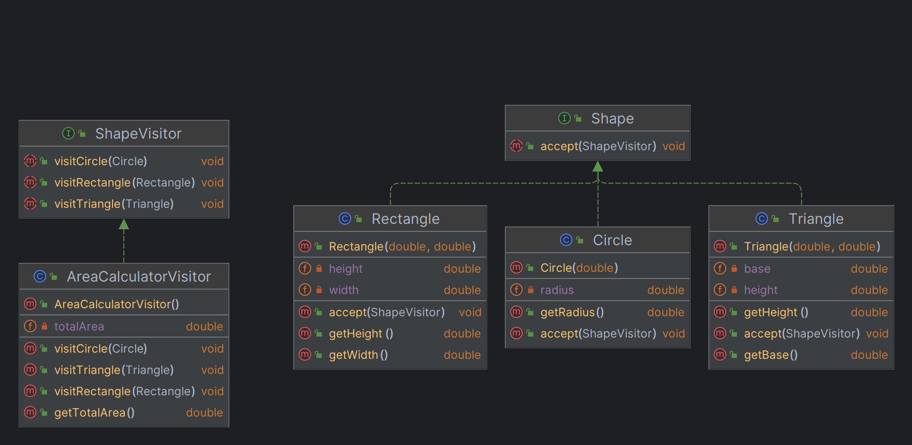

# Visitor

The Visitor design pattern is a behavioral design pattern that allows adding new behaviors or operations to an existing class hierarchy without modifying the classes themselves. It defines a way of separating algorithms from the objects on which they operate.

In the Visitor pattern, a visitor object is created that contains the new operation to be performed on the objects. The visitor object is passed to each object in the class hierarchy, and each object accepts the visitor by invoking a specific method on the visitor. The visitor then performs the operation on the object, using its own implementation.

The Visitor pattern is useful when new operations need to be added to a class hierarchy without modifying the existing classes. It can also be used when multiple operations need to be performed on objects in a class hierarchy, and it is not desirable to add all these operations to the classes themselves.

## How does the visitor pattern works?
1. Visitor: defines the interface for the new operation that can be performed on the objects in the class hierarchy. It declares a visit method for each class in the hierarchy that it can visit.
2. Concrete Visitor: implements the Visitor interface and provides the implementation for each visit method.
3. Element: defines the interface for accepting the visitor. It declares an accept method that takes a Visitor object as an argument.
4. Concrete Element: implements the Element interface and provides the implementation for the accept method. It also defines the specific behavior for the visit method called by the Visitor.

## Example
