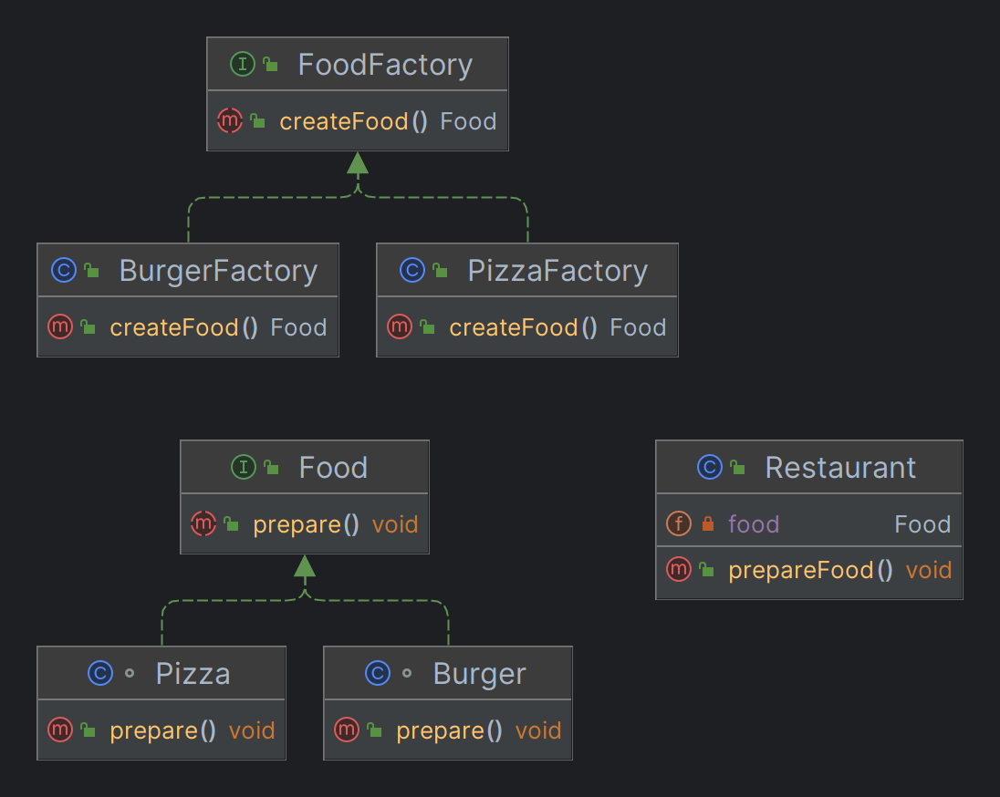

# Abstract Factory
## Definition
Abstract Factory is a creational design pattern that provides an interface for creating families of related 
or dependent objects without specifying their concrete classes. 
The key idea behind this pattern is to have a factory interface with several methods 
that return objects of different types. Each method returns an object of a specific type, 
which is related to the type of factory.

This design pattern is used in situations where a system must be independent of the way the objects 
it creates are generated, composed, and represented. 
The objects created by an abstract factory are guaranteed to be compatible, 
meaning that they will work together as a system.

For example, you can have an abstract factory for creating different types of cars, 
such as Sports Car Factory and Family Car Factory. The Sports Car Factory creates objects of type Sports Car,
while the Family Car Factory creates objects of type Family Car.

The Abstract Factory design pattern is a high-level pattern that is used to create objects that are related by 
a common theme. This pattern can be used to abstract the creation of complex objects, making it easier to change
the way they are created without affecting the client code.
## Explanation
Abstract Factory design pattern is one of the Creational pattern. Abstract Factory pattern is almost similar to
Factory Pattern and is considered as another layer of abstraction over factory pattern.
Abstract Factory patterns work around a super-factory which creates other factories.
Abstract factory pattern implementation provides us with a framework that allows us to create objects
that follow a general pattern. So at runtime, the abstract factory is coupled with any desired concrete factory
which can create objects of the desired type.
## dif between abstract and method factory
The Abstract Factory pattern provides a way to create a family of related objects, 
while the Factory Method pattern
provides a way to create objects of a single class.

## Example

