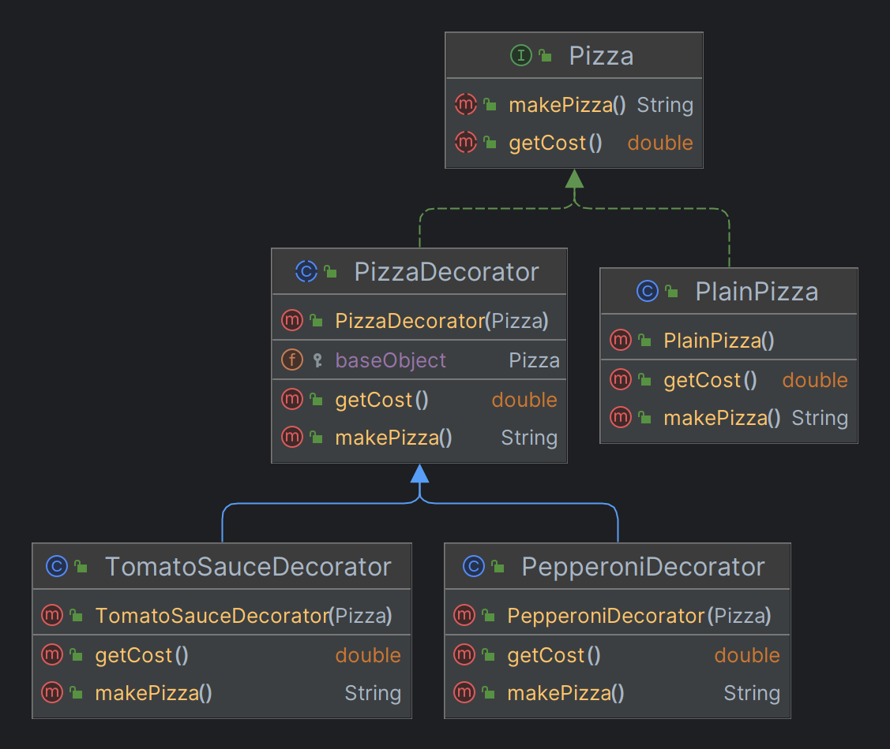

# Decorator

The decorator pattern is a way to add additional functionality to an object by wrapping it in a "decorator" object. This allows you to dynamically modify an object at runtime without having to change its original code.

## Decorator vs Inheritance

Both a decorator and inheritance can be used to extend the functionality of a class, but they have different approaches:
* Inheritance consists of creating a new class that extends the behavior of the current class and add new functionality to it. It is good when you want to add functionality that will always be needed.
* With decorator on the other hand, you wrap the object with new functionality whenever you need, meaning it is not tightly coupled like inheritance.

## How does a decorator works?
1. You start first with a base interface that declare the minimum functionality, and you implement this interface in a base class (check Pizza and PlainPizza classes)
2. After that you create a base decorator that implements that base interface. This base decorator should contain a field of the component interface with a construct that take it as input. This way we can create new object that wrap the old one. (check PizzaDecorator class)
3. From here you can create as many decorator as you want that extend the base decorator, and add functionality to its methods (check TomatoSauceDecorator and PepperoniDecorator classes)

## Example

